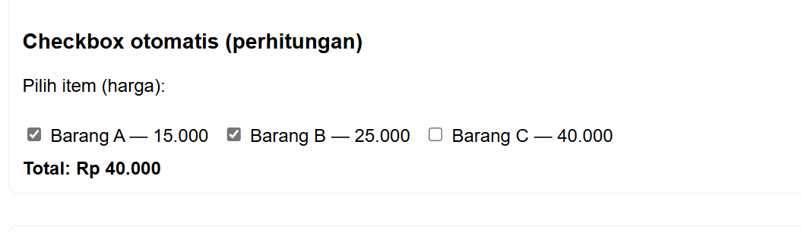

#  Laporan Praktikum 5 - JavaScript

##  Identitas
| Nama | NIM | Kelas |
|------|-----|--------|
| **Afdhal Agislam** | *(312410445)* | *(TI 24 A5)* |

---

##  Tujuan Praktikum
1. Mempelajari dasar-dasar penggunaan **JavaScript** pada halaman web.  
2. Menerapkan JavaScript untuk menampilkan **output**, membuat **interaksi pengguna**, serta **memanipulasi elemen HTML (DOM)**.  
3. Menerapkan **logika, kondisi, dan perhitungan** dalam JavaScript.  
4. Membuat **validasi form input** agar data yang dimasukkan pengguna sesuai dengan ketentuan.

---

##  Langkah-Langkah Praktikum

## 1. Persiapan Folder dan File
- Buat folder baru bernama **`lab5_javascript`**.  
- Di dalam folder tersebut buat tiga file utama:

- File `lab5_javascript.html` berisi struktur HTML utama.  
- File `eksternal.js` berisi kode program JavaScript eksternal.  
- File `README.md` digunakan untuk laporan hasil praktikum.


---

## 2. Membuat File HTML Dasar
Tambahkan kode HTML utama dan hubungkan dengan file JavaScript eksternal menggunakan:
```html
<script src="eksternal.js" defer></script>
```
## Gunakan elemen:

Input, Button, dan Select untuk interaksi pengguna.
Div atau Paragraph untuk menampilkan hasil dari JavaScript.

## 3. Menambahkan Script JavaScript Eksternal
Buat file eksternal.js yang berisi berbagai contoh penerapan JavaScript berikut:

### a. Menampilkan output di halaman
```html
document.getElementById("docwrite-target").innerHTML = "<strong>Halo, saya Afdal Agislam!</strong>";
console.log("Hello World dari Afdal Agislam");
```
Menampilkan teks di halaman dan menulis pesan di console browser.


### b. Membuat alert, prompt, dan confirm
```html
alert("Halo! Ini alert dari Afdal Agislam");
const nama = prompt("Masukkan nama Anda:", "Afdal Agislam");
const yakin = confirm("Apakah Anda yakin, Afdal Agislam?");
```
### Fungsi:

- alert() → menampilkan pesan pop-up.
- prompt() → meminta input dari pengguna.
- confirm() → memberikan pilihan OK atau Cancel.


### c. Operasi aritmatika dan kondisi
```html
const a = Number(document.getElementById("angkaA").value);
const b = Number(document.getElementById("angkaB").value);
const hasil = a + b;
```
### Hasilnya ditampilkan di halaman, dengan tambahan kondisi:
Jika jumlah genap → tampilkan “jumlah genap”
Jika ganjil → tampilkan “jumlah ganjil”.


### d. Percabangan menggunakan switch
```html
switch (val) {
  case "1": hasil = "Senin - Semangat baru dari Afdal Agislam!"; break;
  case "2": hasil = "Selasa - Tetap produktif 💪"; break;
  case "3": hasil = "Rabu - Tetap fokus belajar"; break;
  case "4": hasil = "Kamis - Jangan lupa istirahat"; break;
  case "5": hasil = "Jumat - Hari penuh berkah"; break;
}
```
Menampilkan teks hari sesuai dengan pilihan pengguna.


### e. Validasi Form Input (Tugas Praktikum)
Bagian ini berfungsi untuk mengecek apakah pengguna sudah mengisi form dengan benar.
```html
const form = document.getElementById("form-sample");
form.addEventListener("submit", function (ev) {
  ev.preventDefault();
  const nama = document.getElementById("nama").value.trim();
  const email = document.getElementById("email").value.trim();
  const umur = Number(document.getElementById("umur").value);
  const result = document.getElementById("form-result");
  const errors = [];

  if (nama.length < 3) errors.push("Nama minimal 3 karakter.");
  if (!/^[^\s@]+@[^\s@]+\.[^\s@]+$/.test(email)) errors.push("Format email tidak valid.");
  if (!Number.isInteger(umur) || umur <= 0 || umur > 120) errors.push("Umur harus antara 1–120.");

  if (errors.length > 0) {
    result.style.color = "red";
    result.innerHTML = "Kesalahan input oleh Afdal Agislam:<br> - " + errors.join("<br> - ");
  } else {
    result.style.color = "green";
    result.textContent = `Data valid! Terima kasih, ${nama}. (Divalidasi oleh Afdal Agislam)`;
  }
});
```
### Hasil Validasi:
- Jika salah → Pesan merah:
```css
Kesalahan input oleh Afdal Agislam:
- Format email tidak valid.
```
- Jika benar → Pesan hijau:
```scss
Data valid! Terima kasih, Afdal Agislam. (Divalidasi oleh Afdal Agislam)
```


### f. Checkbox otomatis (Perhitungan)
Menjumlahkan harga barang yang dicentang:
```html
const items = document.querySelectorAll(".item");
function hitungTotal() {
  let total = 0;
  items.forEach(i => { if (i.checked) total += Number(i.dataset.price); });
  document.getElementById("total-harga").textContent = total.toLocaleString("id-ID");
}
```
Hasil total langsung berubah setiap kali checkbox dicentang atau dilepas.



### g. Manipulasi DOM
Mengubah teks HTML secara dinamis:
```html
document.getElementById("demo-text").textContent =
  `Teks ini telah diubah oleh Afdal Agislam pada ${new Date().toLocaleString()}`;
```
Saat tombol ditekan, teks berubah secara otomatis.


## 4. Menjalankan File di Browser
- Jalankan file lab5_javascript.html di browser (klik dua kali atau pakai VSCode Live Server).
- Uji semua fitur:
 - Alert / Prompt / Confirm
 - Aritmatika
 - Switch Hari
 - Validasi Form
 - Checkbox Perhitungan
 - Manipulasi Teks DOM

## 5. Validasi HTML
Gunakan validator.w3.org
 untuk memeriksa apakah struktur HTML valid.

### Hasil Praktikum
| No | Percobaan                | Hasil di Browser                                    |
| -- | ------------------------ | --------------------------------------------------- |
| 1  | Output & Console         | Teks “Halo, saya Afdal Agislam!” dan log di console |
| 2  | Alert / Prompt / Confirm | Muncul pop-up interaktif                            |
| 3  | Aritmatika               | Hasil operasi muncul di bawah tombol “Hitung”       |
| 4  | Switch Hari              | Menampilkan teks sesuai pilihan                     |
| 5  | Validasi Form            | Menampilkan pesan error atau sukses                 |
| 6  | Checkbox                 | Total harga otomatis berubah                        |
| 7  | Manipulasi DOM           | Paragraf berubah teks dan menampilkan waktu         |
```
```
## Pertanyaan dan Tugas
### 1. Buat script untuk melakukan validasi pada isian form.
#### Jawaban:
Script validasi form terdapat pada bagian ke-5️⃣ di file eksternal.js.
Fungsinya adalah memeriksa isian form sebelum dikirim ke server.
- Nama minimal 3 karakter
- Email harus mengandung “@” dan “.”
- Umur harus angka 1–120
#### Hasil:
- Jika data salah → tampil pesan merah (kesalahan).
- Jika data benar → tampil pesan hijau (valid).
#### Kesimpulan:
Script validasi ini memastikan input pengguna sudah sesuai dan menampilkan pesan konfirmasi dengan nama Afdal Agislam sebagai pembuatnya.


## Kesimpulan

#### 1. JavaScript memungkinkan halaman web menjadi interaktif dan dinamis.
#### 2. Dengan file eksternal (eksternal.js), kode menjadi lebih rapi dan mudah dikelola.
#### 3. Praktikum ini berhasil menunjukkan penggunaan:
- alert, prompt, confirm
- Operasi aritmatika dan kondisi
- Struktur switch
- Validasi form input
- Manipulasi elemen DOM
- Checkbox perhitungan otomatis
#### 4. Semua fitur telah diuji dan berfungsi dengan baik.
#### 5.Hasil validasi menampilkan pesan personal:
## “Divalidasi oleh Afdal Agislam.”

